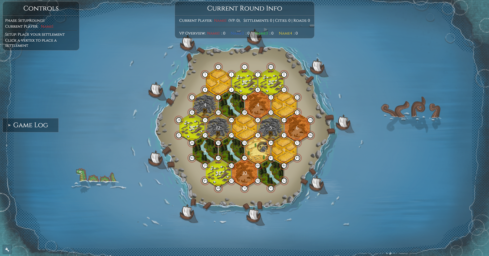
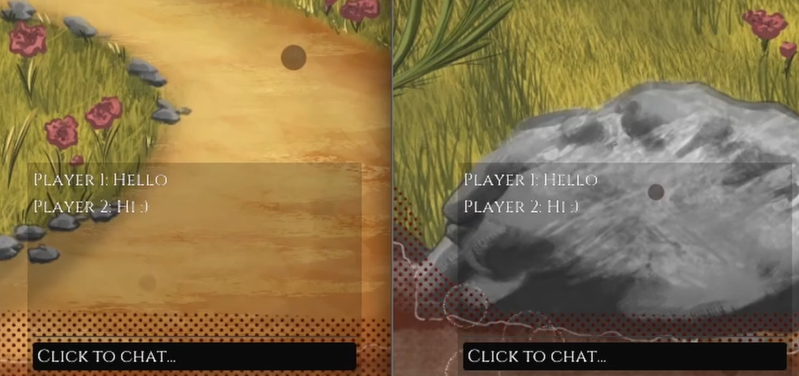

# The Settlers of Catan - Rust Edition
### LMU WS25/26 Rust SEP: Multiplayer Game Development
A digital implementation of "The Settlers of Catan", built in Rust using the Bevy game engine, with experimental multiplayer support.

## Quickstart
1. git clone https://github.com/rockenjoyer/catan-rust.git
2. cd catan-rust
3. cargo run

Alternatively, run the compiled .exe file (if available).

## Gameplay features
### Board
The board consists of 19 hexagonal tiles, 18 resource tiles and one desert tile; they are surrounded by the sea. Resource tiles contain one number plate each. All tiles and their number plates are always generated randomly.

### Game phases
The game consists of two phases, the setup rounds and regular play.

  - During the setup rounds, all players get to pick a location for a settlement and build a road starting at its location. The pick order follows the order of the players, clockwise in the first setup round, counter-clockwise in the second one.
  - Once regular gameplay is reached, all other features are unlocked for every player. Each turn, a set of two regular dice is rolled, both rolled numbers are added up to one final number which determines the resources that are being given out in each round according to the number plates on the resource tiles. In case a 7 is rolled, the robber has to be moved to a resource tile which gets blocked and players with too many resources are being robbed. 
  - Regular gameplay ends as soon as a player wins (which happens after reaching 10 victory points).

### Actions
#### Spending resources
Once a player has collected enough resources, they may construct a building on the board or buy a development card.
  - Road: constructing a road requires one Brick and one Lumber, it may be placed originating from any existing settlement, city or road of the player. If a player has built a continuous road longer than any other player's chain with a length of at least five, they are being granted the Longest Road badge, worth two victory points.
  - Settlement: constructing a settlement requires one Brick, one Lumber, one Grain and one Wool, it may be placed on any vertex connected to a road of the player, unless there is already a settlement or city directly adjacent to the chosen one. Settlements grant one victory point and produce one resource if a number on one of the resource tiles around it is rolled during the turn.
  - City: upgrading a settlement to a city requires three Ore and two Grain, any settlement can be upgraded to a city. Cities grant an additional victory point and produce twice the amount of resources settlements do.
  - Development card: buying a development card requires one Ore, one Grain and one Wool. There are five different development cards which can be played at any point during the player's turn.

#### Development cards
After buying a development card, a player has to wait one round before they may use it (except for the Victory Point card). There are five types of development cards:
  - Knight: playing a Knight card allows the player to move the robber without relying on rolling a 7. However, players with too many resources are not being robbed in this case. If a player has more knight cards as any other player (minimum: three) they are being granted the Largest Army badge, worth two victory points.
  - Victory point: this card grants one victory point.
  - Monopoly: playing this card allows the player to select one resource. All other players are forced to surrender their entire stock of the chosen resource to the player.
  - Road Building: this card allows the player to build two roads for free.
  - Year of Plenty: this card allows the player to select two resources which they will recieve for free.

#### Trading (not fully implemented yet)
A player can trade to exchange resources. Two types of trading exist.
  - Player trade: a player can ask other players to exchange resources, they can choose any resources and any ratio. No one is however forced to actually trade with them.
  - Maritime trade: allows a player to trade without relying on other players. The trading ratio, however, is 4:1, but can be reduced to 3:1 or 2:1 by owning a settlement on a generic harbor or a resource-specific harbor respectively.
Both types of trading and harbors are implemented into the game's code, but are not able to be used yet because the necessary UI is still missing.

## Menu features and overview
### Main Menu
The Main Menu serves as the central "navigation hub" of the game. It provides access to gameplay, multiplayer functionality, rules, settings and game exit.

#### Start Game
The "Start Game" button launches a local singleplayer session, where up to 4 players can technically play against each other on a single machine. The game transitions directly into the setup phase and initializes all required systems (board generation, assets, panels, audio etc.).

#### Multiplayer
Upon clicking on "Multiplayer", the multiplayer submenu opens.
From here, players can host or join a game (see below in the multiplayer section).

#### Rules
Players have the option to read the rules to stay up-to-date. The "Rules" button opens a purely informational rules overview, which is presented in structured sections. Players can read about:

  1. Setup
  2. Resources
  3. Turn Structure
  4. Robber
  5. Victory Points

#### Settings
In the bottom left corner, upon clicking on the "🔧" icon, the settings menu opens. It is also available ingame. Available options are:

  - Music and SFX volume slider
  - Window Mode: Windowed, Borderless Fullscreen & Fullscreen
  - Resolution Presets: 1280 x 720, 1920 x 1080 & 2560 x 1440

When accessed during gameplay, an additional option to "Return to Main Menu" is available.
Settings are applied immediately, there's no need to restart the game.

#### Quit Game
The "Quit Game" button closes the application immediately, which is also available on the endscreen. Of course, it is also possible to simply close the window.

### Endscreen
The Endscreen appears once a player reaches the victory condition of 10 Victory Points. It appears similar to the main menu, with changes to the available buttons. 

#### Return to Main Menu
A "Return to Main Menu" button is now available, which also resets the current game state.

#### Credits
By clicking on the "Credits" button, various project credits will be displayed:
  - Development Team
  - Bevy Game Engine & Rust Programming Language
  - Original Game Inspiration

#### Stats
The "Stats" button displays statistics of the previous gameplay. These contain:
  - Winner
  - Victory Points of each player
  - Settlement-, City-, Road- & Resource count of each player
  - Achievements: Longest Road & Largest Army

## Multiplayer
### Hosting a game
From the multiplayer menu, click "Host". This launches the lobby, where a "Join Code" is displayed.

Note: The planned dynamic join code functionality is not yet fully implemented. Currently, the "Join Code" is simply the local IP address of the host machine. Clients require this IP address to connect directly to the host.

Once at least one client is connected in the lobby, the host can start the game. The lobby includes a chat functionality for communication between players.

### Joining a game
In order to join a lobby, enter the "Join Code" provided by the host and then click "Join".

If the code is correct, you will join the host’s lobby. The host controls when the game starts, and all connected players will be prompted to begin simultaneously.

### Limitations
#### Current state
Multiplayer functionality is not fully operational and has several limitations.

#### Input handling
Connected players cannot interact directly with the game in multiplayer mode. Input handling for in-game actions (e.g., building roads, settlements, or rolling dice) is not implemented.

The only way to play in multiplayer is through the chat system. Players must manually type their moves and communicate them to others.

While this is not ideal, it is currently the only available method for multiplayer interaction.

#### Lack of features and safety nets
No graceful disconnect: If a player or host disconnects unexpectedly, the game may crash or behave unpredictably.

No host migration: If the host leaves, the game cannot automatically assign a new host. This will have no immediate effect on the clients, since the launched game runs locally, but chat communication will stop working.

Some state transitions are not handled correctly. Issues arise when: a host leaves the lobby, or a client disconnects and attempts to rejoin.

These limitations can lead to frustrating errors, program panics, or unstable behavior.

#### Unused or Incomplete Code
Due to shifting priorities and time constraints, some planned features were deprioritized or dropped in favor of core functionality. As a result, there may be unused code snippets, structs, or functions that remain in the codebase but are not fully implemented or integrated.

While every effort has been made to document the project thoroughly, some unresolved or unused code fragments may still exist. These remnants do not currently impact functionality or stability.

## Misc
### Cargo features
*Find the list and description in [cargo.toml](Cargo.toml)*

## Credits
### Game Assets
#### Sounds
- [Placing down](
https://freesound.org/people/Jaszunio15/sounds/421243/
)
- [Click](
https://pixabay.com/sound-effects/film-special-effects-computer-mouse-click-352734/
)
- [Dice](
https://freesound.org/people/Code_E/sounds/575176/
)
- [Win](
https://freesound.org/people/el_boss/sounds/677859/
)
- OST:
    - background_music0.ogg: https://www.youtube.com/watch?v=LVqyrKUia58
  - background_music1.ogg: self-made

#### Art
- [Catan Logo](
https://www.catan.de/catan-universe 
)
- Cards: Matt Mocarski
- Rest: self-made

## Disclaimer
The use of generative AI was limited to the [Mistral Ai Le Chat](https://chat.mistral.ai/chat).

Generative AI was exclusively employed for:
- Error handling of non-descriptive panics or crashes
- Documentation searches for continuously evolving libraries that lacked comprehensive or up-to-date documentation

No generative AI was used for core logic, gameplay mechanics, or creative decision-making.
